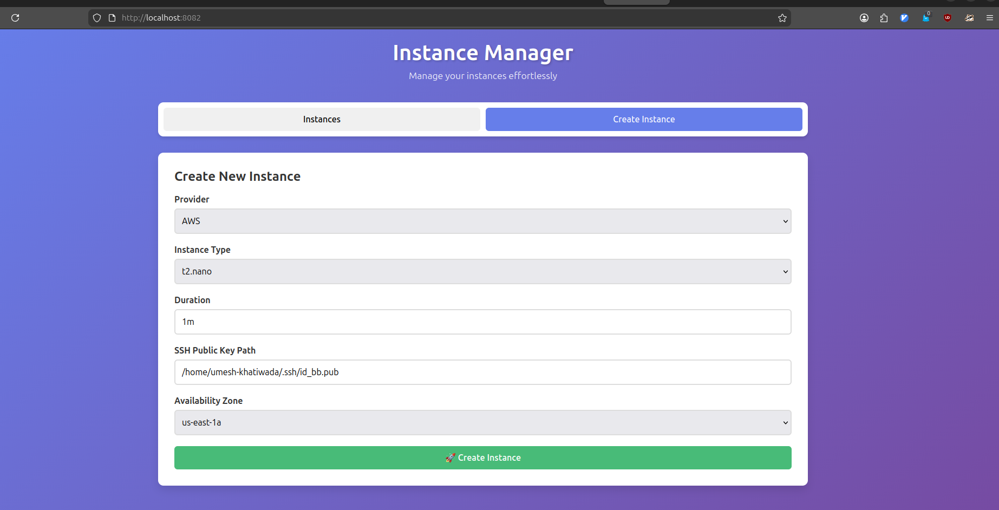
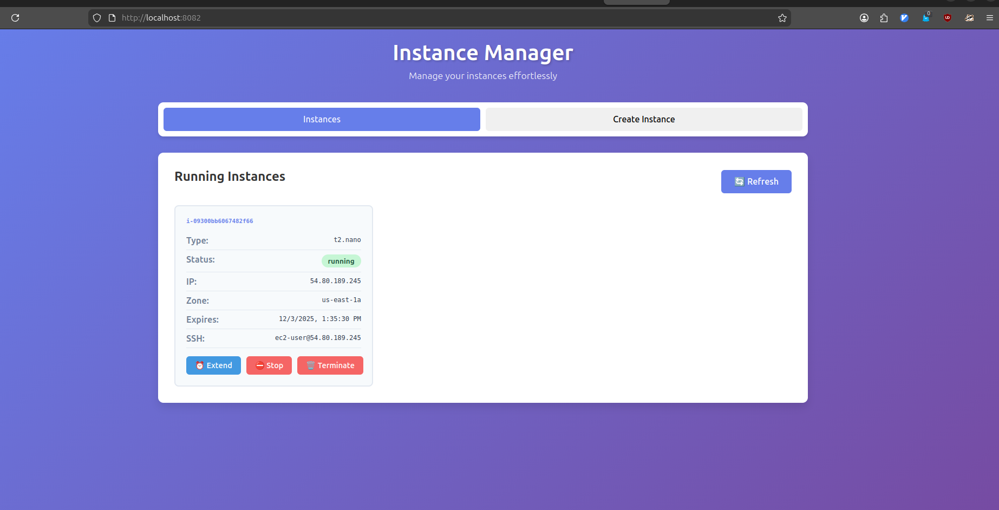

# Instance Manager

A Go-based CLI tool for managing compute instances with automatic lifecycle management.

## Features

- Create instances with custom configurations
- Monitor instance status and retrieve connection details
- Automatic instance stopping based on duration (instances can be restarted if TTL is extended)
- **Enhanced TTL management**: Extend instance lifetime and automatically restart stopped instances
- **Intelligent lifecycle management**: Background service monitors TTL changes and manages instance state
- **Advanced logging**: Configurable log levels with structured logging to stdout
- Support for custom instance types, duration, and SSH keys
- Modular design with interfaces for future cloud provider support (GCP, Azure, AWS, DigitialOcean, NeoClouds)
- Comprehensive unit testing

## Prerequisites

### AWS Configuration
Set the following environment variables:
```bash
export AWS_ACCESS_KEY_ID=your_access_key_id
export AWS_SECRET_ACCESS_KEY=your_secret_access_key
export AWS_REGION=us-east-1
```

### Dependencies
- Go 1.21 or higher
- Valid AWS account with EC2 permissions
- SSH public key file (.pub)

## Installation

1. Clone the repository:
```bash
git clone <repository-url>
cd instance-manager
```

2. Install dependencies:
```bash
go mod tidy
```

3. Build the application:
```bash
go build -o instance-manager cmd/main.go
```

## Usage

### Create an Instance

```bash
# Basic usage with defaults
./instance-manager create --provider aws -d 1m --public-key ~/.ssh/id_rsa.pub

# Custom configuration
./instance-manager create \
  --provider aws \
  --instance-type t2.micro \
  --duration 2h \
  --public-key ~/.ssh/id_rsa.pub \
  --availability-zone us-east-1ab
```



### Check Instance Status

```bash
# Check status of a specific instance
./instance-manager status --instance-id i-1234567890abcdef0

# List all managed instances
./instance-manager list
```

### Extend Instance TTL

```bash
# Extend instance lifetime by 2 hours
./instance-manager extend --instance-id i-1234567890abcdef0 --duration 2h

# Extend by 30 minutes
./instance-manager extend --instance-id i-1234567890abcdef0 --duration 30m
```

### Run Background Service

```bash
# Run with default info logging
./instance-manager service

# Run with debug logging
./instance-manager service --log-level debug --verbose

# Run with specific log level
./instance-manager service --log-level warn
```

### Stop an Instance

```bash
./instance-manager stop --instance-id i-1234567890abcdef0
```

## Parameters

| Parameter | Description | Default | Required |
|-----------|-------------|---------|----------|
| `--instance-type` | EC2 instance type | t2.nano | No |
| `--duration` | Instance runtime duration | 1h | No |
| `--public-key` | Path to SSH public key file | - | Yes |
| `--availability-zone` | AWS availability zone | us-east-1a | No |
| `--provider` | Cloud provider (aws, gcp) | aws | No |

## Architecture

The project follows a modular architecture with clear separation of concerns:

```
├── cmd/                    # Command-line interface
├── pkg/
│   ├── cloud/             # Cloud provider interfaces
│   ├── aws/               # AWS implementation
│   ├── config/            # Configuration management
│   ├── models/            # Data structures
│   └── storage/           # Instance tracking storage
├── internal/
│   ├── scheduler/         # Background job scheduler
│   └── utils/             # Utility functions
├── test/                  # Integration tests
└── docs/                  # Documentation
```

## Cloud Provider Interface

The system is designed with a cloud provider interface that allows easy extension to other providers:

```go
type CloudProvider interface {
    CreateInstance(config InstanceConfig) (*Instance, error)
    GetInstanceStatus(instanceID string) (*InstanceStatus, error)
    TerminateInstance(instanceID string) error
    ListInstances() ([]*Instance, error)
}
```

## Background Job Management

The enhanced background service provides intelligent instance lifecycle management:

### Key Features
- **TTL Monitoring**: Continuously monitors instance expiration times with 10-second data refresh
- **Smart Restart**: Automatically starts stopped instances when TTL is extended
- **State Synchronization**: Keeps local storage in sync with actual cloud instance states
- **Configurable Logging**: Supports debug, info, warn, error log levels with structured output
- **Efficient Polling**: Checks instance state every 30 seconds, reloads data every 10 seconds

### Use Cases
1. **TTL Extension**: When you extend an instance's TTL using the `extend` command, the service detects the change and automatically starts the instance if it's stopped
2. **Automatic Cleanup**: Stops instances when they exceed their configured duration (instances can be restarted if TTL is extended)
3. **State Recovery**: Detects and corrects state drift between local records and cloud provider
4. **Monitoring**: Provides detailed logs of all lifecycle operations

### Running the Service
```bash
# Production deployment
./instance-manager service --log-level info

# Development/debugging
./instance-manager service --log-level debug

# Minimal logging
./instance-manager service --log-level error
```



Instance metadata is stored in JSON format for persistence and quick access.

## Testing

Run unit tests:
```bash
go test ./...
```

Run tests with coverage:
```bash
go test -cover ./...
```

Run integration tests (requires AWS credentials):
```bash
go test -tags=integration ./test/...
```

## Contributing

1. Fork the repository
2. Create a feature branch
3. Add tests for new functionality
4. Ensure all tests pass
5. Submit a pull request

## License

MIT License - see LICENSE file for details.

## Security Notes

- Never commit AWS credentials to version control
- Use IAM roles when running on EC2 instances
- Regularly rotate access keys
- Follow AWS security best practices

## Troubleshooting

### Common Issues

1. **AWS credentials not found**: Ensure environment variables are set correctly
2. **Permission denied**: Verify IAM user has necessary EC2 permissions
3. **Key pair not found**: Ensure the SSH public key file exists and is readable
4. **Instance limit exceeded**: Check AWS service limits for your account

### Debug Mode

Enable verbose logging:
```bash
./instance-manager --verbose -d 1m create --public-key ~/.ssh/id_rsa.pub
```

## Roadmap

- [ ] Support for GCP, Azure and major NeoClouds
- [ ] Web dashboard interface
- [ ] Instance cost tracking
- [ ] Custom AMI support
- [ ] Security group management
- [ ] Volume encryption options
- [ ] Leveraging the spot instances.
- [ ] Support for K8s as GPU Pods as instance
